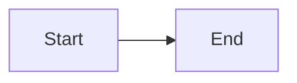

# FLOW: 개발자를 위한 지식 공유 플랫폼

## Getting Start
```bash
## 의존성, 라이브러리 설치
npm install
## 빌드
npm run build
## 실행
npm start
```


## Tech Stack
- React
- tailwindcss
- zustand

## Screen Flow Chart


## Environment Variables
- REACT_APP_KAKAO_CLIENT_ID
- REACT_APP_GOOGLE_CLIENT_ID
- REACT_APP_GITHUB_CLIENT_ID
- REACT_APP_NAVER_CLIENT_ID